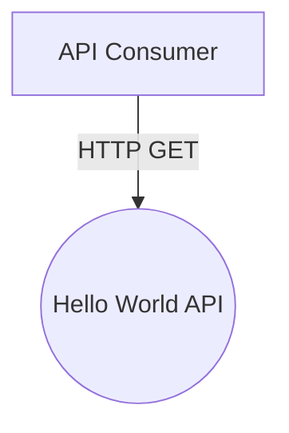
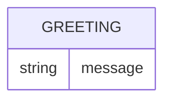
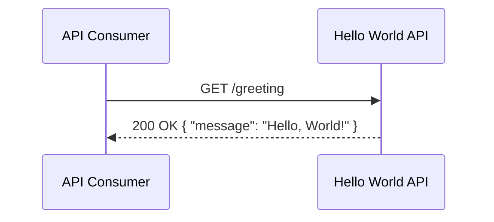

# Hello World API — Design

## Overview

A single, minimal Ballerina service exposes one public HTTP endpoint that returns a fixed greeting message. It has no authentication, no persistence, no dependencies, and no other components — the entire system is one deployable service serving one story.

## Context (C1)

## Domain model (ER)

The greeting is a fixed, stateless value — not a persisted entity — so the model above exists only to describe the shape of the response body.

## Key flows

